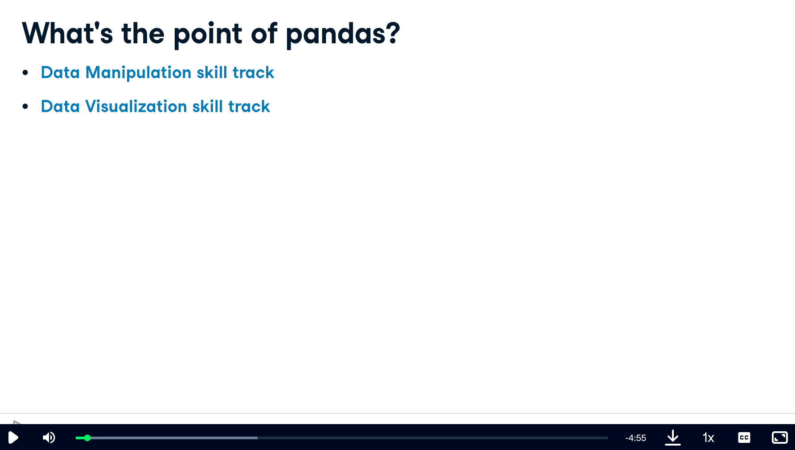
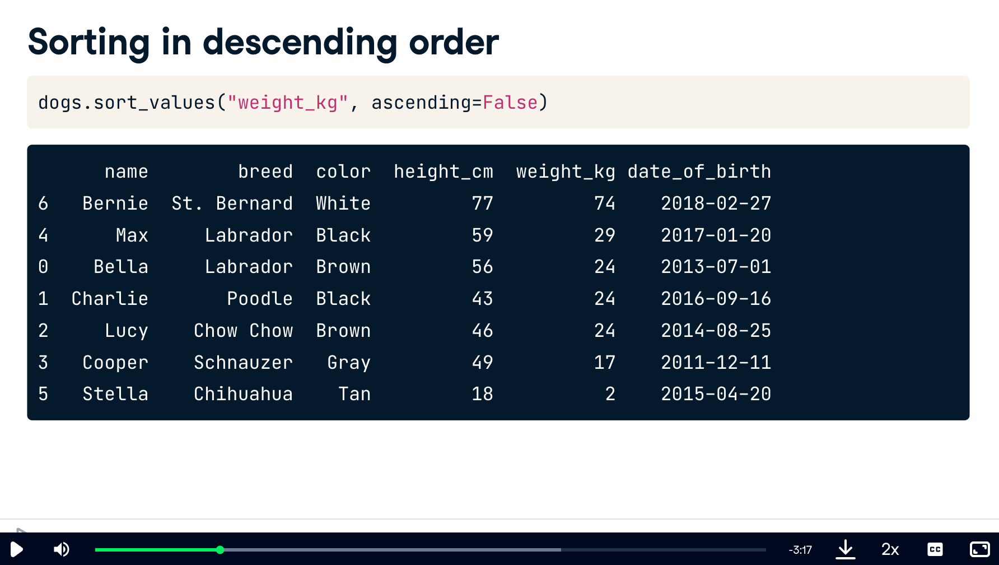

# [Main](https://app.datacamp.com/learn/courses/data-manipulation-with-pandas)

# 1 Transforming DataFrames


Let’s master the pandas basics. Learn how to inspect DataFrames and perform fundamental manipulations, including sorting rows, subsetting, and adding new columns.

## Introducing DataFrames




- whenever you get a new dataset, explore it ith .head()
- .info() diplays names of columns


- .shape -> Displays rows, columns.  This is an attribute, not method, so no ()

- describe computes summary stats


- values shows values in 2D numpy array


- indexs and columns


## Inspecting a DataFrame

When you get a new DataFrame to work with, the first thing you need to do is explore it and see what it contains. There are several useful methods and attributes for this.

- .head() returns the first few rows (the “head” of the DataFrame).
- .info() shows information on each of the columns, such as the data type and number of missing values.
- .shape returns the number of rows and columns of the DataFrame.
- .describe() calculates a few summary statistics for each column.

homelessness is a DataFrame containing estimates of homelessness in each U.S. state in 2018. The individual column is the number of homeless individuals not part of a family with children. The family_members column is the number of homeless individuals part of a family with children. The state_pop column is the state's total population.

pandas is imported for you.
```python
# Print the head of the homelessness data
print(homelessness.head())
```

```python
# Print the head of the homelessness data
print(homelessness.head())

# Print information about homelessness
print(homelessness.info())

# Print the shape of homelessness
# num of rows/cols
print(homelessness.shape)

# Print a description of homelessness
# summary stats
print(homelessness.describe())
```


## Parts of a DataFrame

To better understand DataFrame objects, it's useful to know that they consist of three components, stored as attributes:

- .values: A two-dimensional NumPy array of values.
- .columns: An index of columns: the column names.
- .index: An index for the rows: either row numbers or row names.

You can usually think of indexes as a list of strings or numbers, though the pandas Index data type allows for more sophisticated options. (These will be covered later in the course.)

homelessness is available.

```python
# Import pandas using the alias pd
import pandas as pd

# Print the values of homelessness
print(homelessness.values)

# Print the column index of homelessness
print(homelessness.columns)

# Print the row index of homelessness
print(homelessness.index)
```

## Sorting and subsetting

- sorting rows


- sort ascending



- sort by multiple features/variables


- now with specific orders


- zoom in just on one column


- subsetting multiple columns


- conditionally subset rows: getting logical vector


- conditionally subset rows: actually doing it


- subset rows based on text data


- subset based on dates


- subset based on multiple conditions


- filter on multiple values of categorical variable.  use `is.in()` method


## Sorting rows

## Subsetting columns

## Subsetting rows

## Subsetting rows by categorical variables

## New columns

## Adding new columns

## Combo-attack!


# 2 Aggregating DataFrames


## In this chapter, you’ll calculate summary statistics on DataFrame columns, and master grouped summary statistics and pivot tables.

## Summary statistics

## Mean and median

## Summarizing dates

## Efficient summaries

## Cumulative statistics

## Counting

## Dropping duplicates

## Counting categorical variables

## Grouped summary statistics

## What percent of sales occurred at each store type?

## Calculations with .groupby()

## Multiple grouped summaries

## Pivot tables

## Pivoting on one variable

## Fill in missing values and sum values with pivot tables


# 3 Slicing and Indexing DataFrames


## Indexes are supercharged row and column names. Learn how they can be combined with slicing for powerful DataFrame subsetting.

## Explicit indexes

## Setting and removing indexes

## Subsetting with .loc[]

## Setting multi-level indexes

## Sorting by index values

## Slicing and subsetting with .loc and .iloc

## Slicing index values

## Slicing in both directions

## Slicing time series

## Subsetting by row/column number

## Working with pivot tables

## Pivot temperature by city and year

## Subsetting pivot tables

## Calculating on a pivot table


# 4 Creating and Visualizing DataFrames


## Learn to visualize the contents of your DataFrames, handle missing data values, and import data from and export data to CSV files.

## Visualizing your data

## Which avocado size is most popular?

## Changes in sales over time

## Avocado supply and demand

## Price of conventional vs. organic avocados

## Missing values

## Finding missing values

## Removing missing values

## Replacing missing values

## Creating DataFrames

## List of dictionaries

## Dictionary of lists

## Reading and writing CSVs

## CSV to DataFrame

## DataFrame to CSV

## Wrap-up

