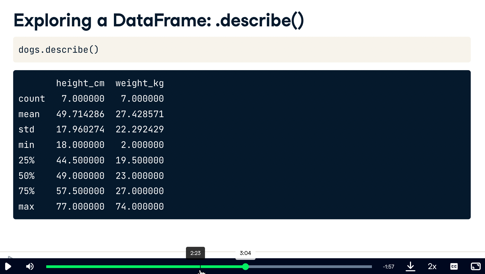

# [Main](https://app.datacamp.com/learn/courses/data-manipulation-with-pandas)

# 1 Transforming DataFrames


Let’s master the pandas basics. Learn how to inspect DataFrames and perform fundamental manipulations, including sorting rows, subsetting, and adding new columns.

## Introducing DataFrames


- whenever you get a new dataset, explore it ith .head()
- .info() diplays names of columns


- .shape -> Displays rows, columns.  This is an attribute, not method, so no ()

- describe computes summary stats



- values shows values in 2D numpy array


- indexs and columns


## Inspecting a DataFrame

When you get a new DataFrame to work with, the first thing you need to do is explore it and see what it contains. There are several useful methods and attributes for this.

- .head() returns the first few rows (the “head” of the DataFrame).
- .info() shows information on each of the columns, such as the data type and number of missing values.
- .shape returns the number of rows and columns of the DataFrame.
- .describe() calculates a few summary statistics for each column.

homelessness is a DataFrame containing estimates of homelessness in each U.S. state in 2018. The individual column is the number of homeless individuals not part of a family with children. The family_members column is the number of homeless individuals part of a family with children. The state_pop column is the state's total population.

pandas is imported for you.
```python
# Print the head of the homelessness data
print(homelessness.head())
```

```python
# Print the head of the homelessness data
print(homelessness.head())

# Print information about homelessness
print(homelessness.info())

# Print the shape of homelessness
# num of rows/cols
print(homelessness.shape)

# Print a description of homelessness
# summary stats
print(homelessness.describe())
```


## Parts of a DataFrame

To better understand DataFrame objects, it's useful to know that they consist of three components, stored as attributes:

- .values: A two-dimensional NumPy array of values.
- .columns: An index of columns: the column names.
- .index: An index for the rows: either row numbers or row names.

You can usually think of indexes as a list of strings or numbers, though the pandas Index data type allows for more sophisticated options. (These will be covered later in the course.)

homelessness is available.

```python
# Import pandas using the alias pd
import pandas as pd

# Print the values of homelessness
print(homelessness.values)

# Print the column index of homelessness
print(homelessness.columns)

# Print the row index of homelessness
print(homelessness.index)
```

## Sorting and subsetting

- sorting rows


- sort ascending


- sort by multiple features/variables


- now with specific orders


- zoom in just on one column


- subsetting multiple columns


- conditionally subset rows: getting logical vector


- conditionally subset rows: actually doing it


- subset rows based on text data


- subset based on dates


- subset based on multiple conditions


- filter on multiple values of categorical variable.  use `is.in()` method


## Sorting rows

```python
# Sort homelessness by individuals
homelessness_ind = homelessness.sort_values("individuals")

# Print the top few rows
print(homelessness_ind.head())

# Sort homelessness by descending family members
homelessness_fam = homelessness.sort_values("family_members", ascending=False)

# Print the top few rows
print(homelessness_fam.head())

# Sort homelessness by region, then descending family members
homelessness_reg_fam = homelessness.sort_values(["region", "family_members"], ascending=[True, False])

# Print the top few rows
print(homelessness_reg_fam.head())
```

## Subsetting columns

When working with data, you may not need all of the variables in your dataset. Square brackets ([]) can be used to select only the columns that matter to you in an order that makes sense to you. To select only "col_a" of the DataFrame df, use

```python
df["col_a"]
```
To select "col_a" and "col_b" of df, use

```python
df[["col_a", "col_b"]]
```

homelessness is available and pandas is loaded as pd.

```python
# Create an individuals DF from homelessness DF with only the individuals column
individuals = homelessness["individuals"]

# Print the head of the result
print(individuals.head())

# Select the state and family_members columns
state_fam = homelessness[["state", "family_members"]]

# Print the head of the result
print(state_fam.head())

# Select only the individuals and state columns, in that order
ind_state = homelessness[["individuals", "state"]]

# Print the head of the result
print(ind_state.head())
```

## Subsetting rows
A large part of data science is about finding which bits of your dataset are interesting. One of the simplest techniques for this is to find a subset of rows that match some criteria. This is sometimes known as filtering rows or selecting rows.

There are many ways to subset a DataFrame, perhaps the most common is to use relational operators to return True or False for each row, then pass that inside square brackets.

```python
dogs[dogs["height_cm"] > 60]
dogs[dogs["color"] == "tan"]
```
You can filter for multiple conditions at once by using the "bitwise and" operator, &.

```python
dogs[(dogs["height_cm"] > 60) & (dogs["color"] == "tan")]
```
homelessness is available and pandas is loaded as pd.

```python
# Filter for rows where individuals is greater than 10000
ind_gt_10k = homelessness[homelessness["individuals"] > 10000]

# See the result
print(ind_gt_10k)

# Filter for rows where region is Mountain
mountain_reg = homelessness[homelessness["region"] == "Mountain"]

# See the result
print(mountain_reg)

# Filter for rows where family_members is less than 1000
# and region is Pacific
fam_lt_1k_pac = homelessness[(homelessness["family_members"] < 1000) & (homelessness["region"] == "Pacific")]

# See the result
print(fam_lt_1k_pac)
```

## Subsetting rows by categorical variables

Subsetting data based on a categorical variable often involves using the "or" operator (|) to select rows from multiple categories. This can get tedious when you want all states in one of three different regions, for example. Instead, use the .isin() method, which will allow you to tackle this problem by writing one condition instead of three separate ones.

```python
colors = ["brown", "black", "tan"]
condition = dogs["color"].isin(colors)
dogs[condition]
```
homelessness is available and pandas is loaded as pd.

```python
# Subset for rows in South Atlantic or Mid-Atlantic regions
south_mid_atlantic = homelessness[(homelessness["region"] == "South Atlantic") | (homelessness["region"] == "Mid-Atlantic")]

# See the result
print(south_mid_atlantic)

# The Mojave Desert states
canu = ["California", "Arizona", "Nevada", "Utah"]

# Filter for rows in the Mojave Desert states
mojave_homelessness = homelessness[homelessness["state"].isin(canu)]

# See the result
print(mojave_homelessness)
```


## [New columns](https://campus.datacamp.com/courses/data-manipulation-with-pandas/transforming-dataframes?ex=9)


## Adding new columns

You aren't stuck with just the data you are given. Instead, you can add new columns to a DataFrame. This has many names, such as transforming, mutating, and feature engineering.

You can create new columns from scratch, but it is also common to derive them from other columns, for example, by adding columns together or by changing their units.

homelessness is available and pandas is loaded as pd.

```python
# Add total col as sum of individuals and family_members
# how to do a sum of multiple columns using an index range?
homelessness["total"] = sum(homelessness["individuals"], homelessness["family_members"])

# Add p_individuals col as proportion of individuals
homelessness["p_individuals"] = (homelessness["individuals"]/homelessness["total"])

# See the result
print(homelessness)
```

## Combo-attack!

You've seen the four most common types of data manipulation: sorting rows, subsetting columns, subsetting rows, and adding new columns. In a real-life data analysis, you can mix and match these four manipulations to answer a multitude of questions.

In this exercise, you'll answer the question, "Which state has the highest number of homeless individuals per 10,000 people in the state?" Combine your new pandas skills to find out.

- Add a column to homelessness, indiv_per_10k, containing the number of homeless individuals per ten thousand people in each state.
- Subset rows where indiv_per_10k is higher than 20, assigning to high_homelessness.
- Sort high_homelessness by descending indiv_per_10k, assigning to high_homelessness_srt.
- Select only the state and indiv_per_10k columns of high_homelessness_srt and save as result. Look at the result.

```python
# Create indiv_per_10k col as homeless individuals per 10k state pop
homelessness["indiv_per_10k"] = 10000 * homelessness["individuals"] / homelessness["state_pop"]

# Subset rows for indiv_per_10k greater than 20
high_homelessness = homelessness[homelessness["indiv_per_10k"] > 20]

# Sort high_homelessness by descending indiv_per_10k
high_homelessness_srt = high_homelessness.sort_values("indiv_per_10k", ascending=False)

# From high_homelessness_srt, select the state and indiv_per_10k cols
result = high_homelessness_srt[["state", "indiv_per_10k"]]

# See the result
print(result)
```

# 2 Aggregating DataFrames
In this chapter, you’ll calculate summary statistics on DataFrame columns, and master grouped summary statistics and pivot tables.
## Summary statistics


## Mean and median

```python
# Print the head of the sales DataFrame
print(sales.head())

# Print the info about the sales DataFrame
print(sales.info())

# Print the mean of weekly_sales
print(sales["weekly_sales"].mean())

# Print the median of weekly_sales
print(sales["weekly_sales"].median())
```

## Summarizing dates

```python
# Print the maximum of the date column
print(sales['date'].max())

# Print the minimum of the date column
print(sales['date'].min())
```

## Efficient summaries
While pandas and NumPy have tons of functions, sometimes, you may need a different function to summarize your data.

The `.agg()` method allows you to apply your own custom functions to a DataFrame, as well as apply functions to more than one column of a DataFrame at once, making your aggregations super-efficient. For example

```python
df['column'].agg(function)
```

In the custom function for this exercise, "IQR" is short for inter-quartile range, which is the 75th percentile minus the 25th percentile. It's an alternative to standard deviation that is helpful if your data contains outliers.

sales is available and pandas is loaded as pd.

- Use the custom iqr function defined for you along with .agg() to print the IQR of the temperature_c column of sales.

```python
# A custom IQR function
def iqr(column):
    return column.quantile(0.75) - column.quantile(0.25)

# Print IQR of the temperature_c column
print(sales["temperature_c"].agg(iqr))
```
- Update the column selection to use the custom iqr function with .agg() to print the IQR of temperature_c, fuel_price_usd_per_l, and unemployment, in that order.

```python
# A custom IQR function
def iqr(column):
    return column.quantile(0.75) - column.quantile(0.25)

# Update to print IQR of temperature_c, fuel_price_usd_per_l, & unemployment
print(sales[["temperature_c", "fuel_price_usd_per_l", "unemployment"]].agg(iqr))
```

- Update the aggregation functions called by .agg(): include iqr and np.median in that order.

```python
# Import NumPy and create custom IQR function
import numpy as np
def iqr(column):
    return column.quantile(0.75) - column.quantile(0.25)

# Update to print IQR and median of temperature_c, fuel_price_usd_per_l, & unemployment
print(sales[["temperature_c", "fuel_price_usd_per_l", "unemployment"]].agg([iqr, np.median]))
```
## Cumulative statistics


## Counting

## Dropping duplicates

## Counting categorical variables

## Grouped summary statistics

## What percent of sales occurred at each store type?

## Calculations with .groupby()

## Multiple grouped summaries

## Pivot tables

## Pivoting on one variable

## Fill in missing values and sum values with pivot tables


# 3 Slicing and Indexing DataFrames


## Indexes are supercharged row and column names. Learn how they can be combined with slicing for powerful DataFrame subsetting.

## Explicit indexes

## Setting and removing indexes

## Subsetting with .loc[]

## Setting multi-level indexes

## Sorting by index values

## Slicing and subsetting with .loc and .iloc

## Slicing index values

## Slicing in both directions

## Slicing time series

## Subsetting by row/column number

## Working with pivot tables

## Pivot temperature by city and year

## Subsetting pivot tables

## Calculating on a pivot table


# 4 Creating and Visualizing DataFrames


## Learn to visualize the contents of your DataFrames, handle missing data values, and import data from and export data to CSV files.

## Visualizing your data

## Which avocado size is most popular?

## Changes in sales over time

## Avocado supply and demand

## Price of conventional vs. organic avocados

## Missing values

## Finding missing values

## Removing missing values

## Replacing missing values

## Creating DataFrames

## List of dictionaries

## Dictionary of lists

## Reading and writing CSVs

## CSV to DataFrame

## DataFrame to CSV

## Wrap-up

